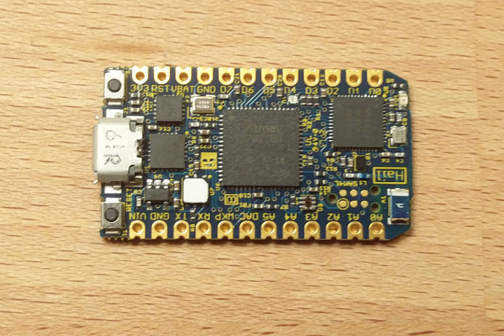

# IoT Workshop - Rustfest Zürich 2017

This workshop will be a hands-on training for developing bare-metal and embedded Linux systems using Rust. You will use Tock-OS to create a low power Bluetooth sensor node on a Hail development board, and build a Smart IoT Gateway using a Raspberry Pi 3. Training and hardware will be provided for developing Rust software on both Microcontroller and Embedded Linux based systems. Attendees will start with a working base example for both devices, and can build new functionality from there. Some experience with Rust and either (or both) Microcontroller or Linux systems is recommended.

## The Schedule

This workshop will be broken in to four major parts, each lasting about an hour with breaks:

1. Introduction and Background Information
2. Develop Microcontroller Software with TockOS
3. Develop Gateway Software on Embedded Linux
4. Additional Challenges and Free Work time

## The Hardware

Today, we will be working with two pieces of hardware:

> A [Raspberry Pi 3] board, acting as an IoT Smart Gateway

[Raspberry Pi 3]: https://www.raspberrypi.org/products/raspberry-pi-3-model-b/

> A [Tock OS Hail] board, acting as a low power IoT device

[Tock OS Hail]: https://www.tockos.org/blog/2017/introducing-hail/

## The Speakers

> James Munns is an Embedded Engineer who has worked on systems ranging from Safety Critical Avionics to Rapidly Prototyped IoT systems. During the day James works at Geeny in Berlin, developing frameworks and tools for IoT Embedded Developers.

> Niklas Adolfsson is embedded software developer at Cybercom in Sweden. He received a B.S. degree at in Electrical at University of Borås and is currently pursing a MSc. in Computer Science at Chalmers University. He is also a contributor to Tock and has worked as a dependability engineer at SP Technical Research Institute of Sweden.

